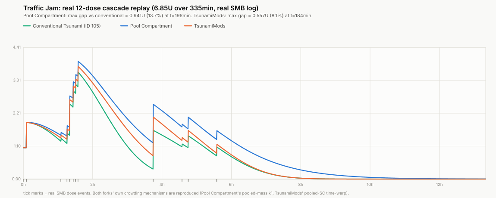

# Traffic Jam insulin model (this fork: original / per-dose curves)

This is the "Lyumjev U100 (Tsunami Traffic Jam)" insulin model, built around one idea: insulin sitting under the skin doesn't all absorb at the same fixed speed. The more of it is, the slower it is absorbed. A series of SMBs slows down the absorption of all previous unabsorbed doses, not just the new dose.

There's another implementation of this same idea on branch `AAPS_dev_PoolCompartment`,
described in its own README, built around a set of shared running tanks rather
than the per-dose curves described below. This file describes what actually runs on this
branch.

Traffic Jam is inspired by piecycle's Tsunami PD model (https://github.com/piecycle/tsunami), which adapts the absorption rate based solely on the individual dose. This branch started as an expansion of that model, but whilst on it, the target PD model itself was changed. That is, the individual activity curve (in the absence of previous doses) isn't the same curve as the plain Tsunami PD models. Traffic Jam's curve was fit independently against the same published Lyumjev absorption data, using a different formula shape. Different formula, different constants — but the two end up producing very similar-looking activity/IOB curves in practice, and that alone should not make much of a difference.

## How it works

Each dose (bolus, extended bolus, temp basal delivery, profile basal) gets its own
activity/IOB curve. All the *actually delivered* insulin — bolus, extended bolus, and real temp basal
delivery — shares one running total, like one shared patch of tissue. Every new dose
raises that total, and every active curve's absorption speed (how spread-out its peak is)
gets recalculated from it. Profile basal (the true baseline, evaluated as if
nothing else was happening) is tracked independently as usual, but following the same mechanism.

## A side effect worth knowing about

Each dose's curve is a fixed shape, indexed by how much time has passed since it was
given — there's no clean way to slow an already-drawn curve down mid-curve without also
deciding what to do with that elapsed-time number. The fix used here: elapsed time is
stretched (the curve is treated as older than it really is), chosen so the reported
*remaining IOB* is continuous. However, the reported *activity* drops abruptly every time the shared total grows. Not a rare edge case: every dose
that adds to the shared total does this to every other currently-active curve, and the
size of the drop scales with how much the total grew — a real, visible kink in the
activity graph, not a rounding artifact. This is the cost from having IOB stay continuous throughout.

## Other things worth knowing

Single isolated doses, nothing else in the system, no time-warp in play: 2U (extrapolated,
no EPAR reference) and 7U/15U/30U at the actual EPAR calibration points, now alongside
`AAPS_dev_PoolCompartment`'s own curve so the two forks can be compared directly, not just
against conventional Tsunami and the real data.

## Real multi-dose behavior

Replaying a real 6.85U/12-SMB sequence from an actual device log (each fork's own
crowding mechanism included — this fork's pooled-SC time-warp, Pool Compartment's
pooled-depot rate) against the plain Tsunami model as a reference: this fork reaches a
peak gap of 0.557U (8.1% of the total dose delivered) around 3h into the sequence, versus
0.941U (13.7%) for Pool Compartment over the same replay. Both forks report meaningfully
more IOB than plain Tsunami would during a run of stacked SMBs; this fork's gap is the
smaller of the two. Neither gap should be closed by preemptively raising basal — it
reflects the crowding model doing its job, not an error — but it's worth knowing which
fork is the gentler transition if switching between them.
