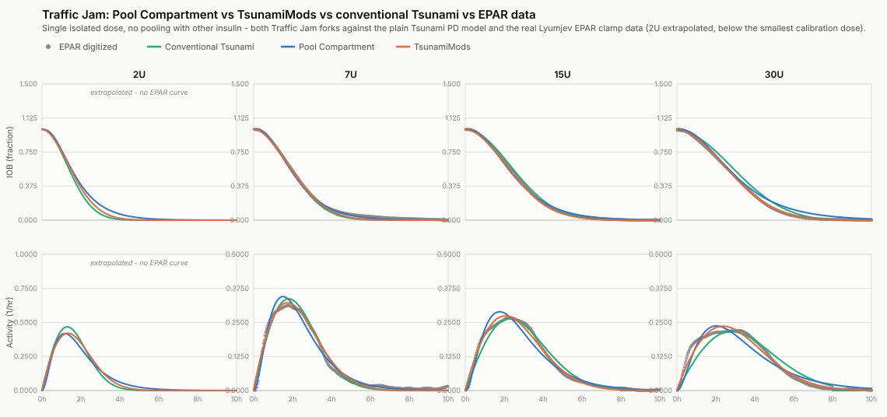
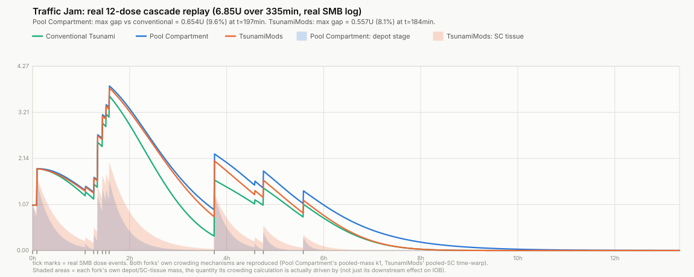

# Traffic Jam insulin model (this fork: Pool Compartment)

This is the "Lyumjev U100 (Tsunami Traffic Jam)" insulin model, built around one idea: insulin sitting under the skin doesn't all absorb at the same fixed speed. The more of it is, the slower it is absorbed. A series of SMBs slows down the absorption of all previous unabsorbed doses, not just the new dose.

There's another implementation of this idea on branch `AAPS_dev_TsunamiMods` (one curve
per dose, rather than the shared tanks below) — see its own README. The present method tackles the problem of activity curve's discontinuity.

Traffic Jam is inspired by piecycle's Tsunami PD model (https://github.com/piecycle/tsunami), which adapts the absorption rate based solely on the individual dose. This branch started as an expansion of that model, but whilst on it, the target PD model itself was changed. That is, the individual activity curve (in the absence of previous doses) isn't the same curve as the plain Tsunami PD models. Traffic Jam's curve was fit independently against the same published Lyumjev absorption data, using a different formula shape. Different formula, different constants — but the two end up producing very similar-looking activity/IOB curves in practice, and that alone should not make much of a difference.

## How it works

Every dose (bolus, extended bolus, temp basal delivery) moves through three stages:
**depot** (sitting under the skin, not yet absorbed), **transit** (moving toward
circulation), **active** (in the blood, doing its job, until cleared). A dose adds
straight into the depot, drains through transit into active, then out. Reported IOB is
whatever's left across all three stages; reported activity is how fast the active stage is
being cleared.

Insulin accumulation in the depot stage only slows the depot's drain rate. The other two stages run at fixed speeds
that never change. The active stage's clearance rate isn't fitted at all, it's pinned to
insulin lispro's real, published half-life (44 minutes). A new dose can
only ever slow down insulin that hasn't left the depot yet. It never affects
insulin that's either in the transit or the active stages.

Profile basal (the true baseline, evaluated as if nothing else was happening) is tracked independently as usual, but following the same mechanism.

## Absorption rates and the fit

The three absorption/transit/clearance rates were originally fit directly against the same
published Lyumjev EPAR clamp data (7/15/30U), by nonlinear least-squares — not against an
intermediate curve. Combined across all three doses that reached R^2 ~= 0.956
(0.982/0.973/0.940 at 7U/15U/30U respectively): closer at the smaller, more common doses,
looser at 30U.

That EPAR-only fit was calibrated purely on isolated single doses at 7/15/30U — there's no
real digitized absorption data anywhere below 7U, yet real AndroidAPS usage is dominated by
small SMBs (mostly under 2U), far outside that range. Checking the EPAR-only fit against
`AAPS_dev_TsunamiMods`' own real 12-dose SMB cascade (individual doses 0.1-1.3U) showed it
deviating from that cascade by up to 7.0% of total dose. The constants now in effect were
refit against TsunamiMods' own PD curve at a widened dose set (1/3.5/7/15/30U — adding two
doses inside the real SMB range, matched against TsunamiMods' independently-derived curve
there since no EPAR data exists for them), which cuts that cascade deviation to 3.8%. The
tradeoff: worse tail accuracy at 15-30U against the real EPAR curves (activity RMSE worsens
~17-25% there) than the EPAR-only fit had. Since real usage is small-SMB-dominated, the
widened-refit constants are the ones in effect; the original EPAR-only values are kept
commented in the source for reference and easy rollback.

Single isolated doses, nothing else in the system: 2U (extrapolated, no EPAR reference)
and 7U/15U/30U at the actual EPAR calibration points, now alongside `AAPS_dev_TsunamiMods`'
own curve so the two forks can be compared directly, not just against conventional Tsunami
and the real data.

## Per-patient absorption speed

A preference (Insulin settings → Absorption Speed, `DoubleKey.InsulinTrafficJamSpeedMultiplier`,
range 0.2-5.0, default 1.0) scales the depot/transit rates (K1, K2) directly: 2.0 means
absorption — and therefore roughly peak activity timing — is twice as fast as standard;
0.5 means half as fast. It's a direct multiplier applied as-is, not a derived "effective
DIA" or other indirect framing, since this model's decay is dose-dependent (crowding) and
asymptotic, so no single duration number would actually be dose-independent or exact.

Elimination (KE) is deliberately never scaled by this knob — it's pinned to insulin
lispro's real, published serum half-life (44 minutes), which doesn't change with how fast
insulin leaves the injection site. Only the depot-to-transit and transit-to-active legs
move.

At the default 1.0, this is an exact no-op: every rate is multiplied by `1.0`, which is
bit-for-bit identical to the unscaled rate, so the default behaves exactly like the fit
described above with no knob present at all.

## Real multi-dose behavior

Replaying a real 6.85U/12-SMB sequence from an actual device log (each fork's own
crowding mechanism included — this fork's pooled-depot rate, TsunamiMods' pooled-SC
time-warp) against the plain Tsunami model as a reference: this fork reaches a peak gap of
0.654U (9.6% of the total dose delivered) around 3.3h into the sequence, versus 0.557U
(8.1%) for TsunamiMods over the same replay. Both forks report meaningfully more IOB than
plain Tsunami would during a run of stacked SMBs; this fork's gap is still the larger of
the two, though the widened refit above brought it much closer to TsunamiMods' own
(previously 13.7% before that refit). Neither gap should be closed by preemptively raising
basal — it reflects the crowding model doing its job, not an error — but it's worth
knowing which fork is the gentler transition if switching between them.
