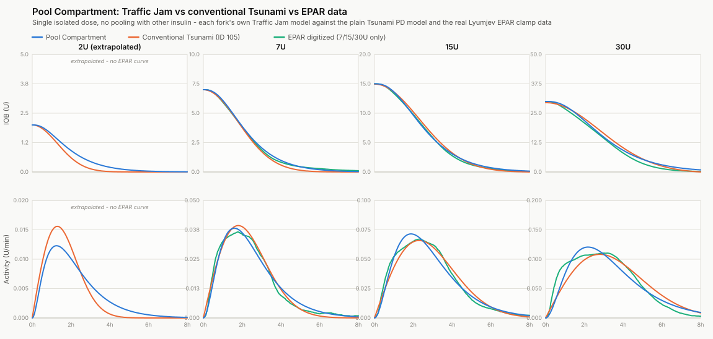

# Traffic Jam insulin model (this fork: original / per-dose curves)

This is the "Lyumjev U100 (Tsunami Traffic Jam)" insulin model, insulin ID 106, built
around one idea: insulin sitting under the skin doesn't all absorb at the same fixed
speed. The more of it is sitting there at once, the slower it soaks in — the same way a
lot of fluid injected into one small patch of tissue takes longer to clear than a small
amount would. Stack a big bolus on top of your basal and correction insulin, and
everything absorbs a bit slower for a while, not just the new dose.

There's another implementation of this same idea on branch `AAPS_dev_PoolCompartment`,
described in its own copy of this file, built around a set of shared running tanks rather
than the per-dose curves described below. This file describes what actually runs on this
branch.

One more thing worth knowing up front: Traffic Jam (ID 106) isn't the same curve as the
plain Tsunami PD models (IDs 105/205, "Lyumjev U100/U200 PD"). Those use an older, separate
formula and fit. Traffic Jam's curve was fit independently against the same published
Lyumjev absorption data, using a different formula shape (rise, peak, tail, rather than a
plain peak-time estimate). Different formula, different constants — but the two end up
producing very similar-looking activity/IOB curves in practice.

## How it works

Each dose (bolus, extended bolus, temp basal delivery, profile basal) gets its own
activity/IOB curve, shaped to match real Lyumjev absorption data (GIR curves at 7/15/30U
from its EPAR filing) — a rise, a peak, then a tail, not the usual bi-exponential shape
AAPS normally uses.

All the *actually delivered* insulin — bolus, extended bolus, and real temp basal
delivery — shares one running total, like one shared patch of tissue. Every new dose
raises that total, and every active curve's absorption speed (how spread-out its peak is)
gets recalculated from it. Profile basal (your programmed baseline, evaluated as if
nothing else was happening) is tracked as a completely separate running total, so boluses
and temp basals never touch it — it stays a clean number to compare actual delivery
against.

## A side effect worth knowing about

Each dose's curve is a fixed shape, indexed by how much time has passed since it was
given — there's no clean way to slow an already-drawn curve down mid-curve without also
deciding what to do with that elapsed-time number. The fix used here: elapsed time is
stretched (the curve is treated as older than it really is), chosen so the reported
*remaining IOB* comes out exactly the same right before and after — the number dosing
decisions actually use. The cost is that reported *activity* for every other active curve
drops immediately, every time the shared total grows. Not a rare edge case: every dose
that adds to the shared total does this to every other currently-active curve, and the
size of the drop scales with how much the total grew — a real, visible kink in the
activity graph, not a rounding artifact. IOB itself stays correct throughout; it's
specifically the activity number (and anything derived from it, like the graph curve)
that dips.

## Other things worth knowing

Single isolated doses, nothing else in the system, no time-warp in play: 2U (extrapolated,
no EPAR reference) and 7U/15U/30U at the actual EPAR calibration points. At 7U all three
curves track closely. At 15U and 30U this fork's curve peaks earlier than both the plain
Tsunami model and the real EPAR data, which stay close to each other — a property of
fitting the whole absorption shape rather than the peak's timing specifically, not
something a different fit removes.

- **Bolus-wizard snooze doesn't actually do anything right now.** It's meant to quiet SMB
  dosing for a while after a manual bolus, but the math behind it cancels itself out at
  every snooze-divisor setting, so it never actually contributes anything.
